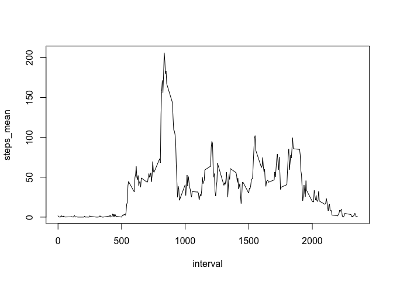
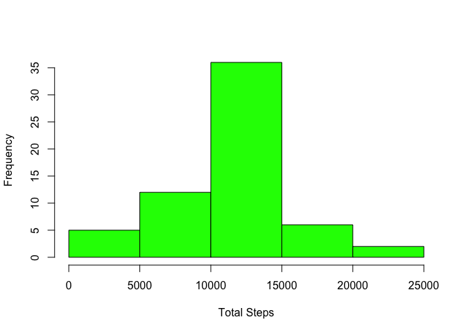
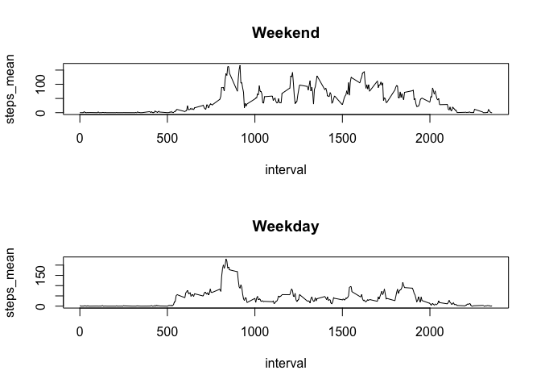

# Assignment1

##Loading and preprocessing the data
The code below will do the following

1. Create a temp file name for downloadling file from [URL](https://d396qusza40orc.cloudfront.net/repdata%2Fdata%2Factivity.zip)
2. Download file using download.file() and set file name = temp
3. Unzip the file to current directory and read it using read.csv()


```r
temp <- tempfile()
download.file("https://d396qusza40orc.cloudfront.net/repdata%2Fdata%2Factivity.zip",temp,method = "curl")
activity <- read.csv(unzip(temp,exdir = "./"))
```

##What is mean total number of steps taken per day?
Include dplyr library and hide the output result

```r
library(dplyr)
```

```
## 
## Attaching package: 'dplyr'
```

```
## The following objects are masked from 'package:stats':
## 
##     filter, lag
```

```
## The following objects are masked from 'package:base':
## 
##     intersect, setdiff, setequal, union
```
Split the data using group_by() and summarize it  

```r
summarize(group_by(activity,date),steps_total=sum(steps,na.rm =TRUE),steps_mean=mean(steps,na.rm =TRUE),steps_median=median(steps,na.rm =TRUE))
```

```
## Source: local data frame [61 x 4]
## 
##          date steps_total steps_mean steps_median
##        (fctr)       (int)      (dbl)        (dbl)
## 1  2012-10-01           0        NaN           NA
## 2  2012-10-02         126    0.43750            0
## 3  2012-10-03       11352   39.41667            0
## 4  2012-10-04       12116   42.06944            0
## 5  2012-10-05       13294   46.15972            0
## 6  2012-10-06       15420   53.54167            0
## 7  2012-10-07       11015   38.24653            0
## 8  2012-10-08           0        NaN           NA
## 9  2012-10-09       12811   44.48264            0
## 10 2012-10-10        9900   34.37500            0
## ..        ...         ...        ...          ...
```
##What is the average daily activity pattern?
Make a time series plot of the 5-minute interval (x-axis) and the average number of steps taken, averaged across all days (y-axis)  

```r
result <- summarize(group_by(activity,interval),steps_mean=mean(steps,na.rm =TRUE))
plot(result,type="l")
```

<!-- -->

Which 5-minute interval, on average across all the days in the dataset, contains the maximum number of steps?  

```r
result[which.max(result$steps_mean),]
```

```
## Source: local data frame [1 x 2]
## 
##   interval steps_mean
##      (int)      (dbl)
## 1      835   206.1698
```
##Imputing missing values
1. Calculate and report the total number of missing values in the dataset

```r
sum(is.na(activity$steps))
```

```
## [1] 2304
```
2. Devise a strategy for filling in all of the missing values in the dataset. The strategy does not need to be sophisticated. For example, you could use the mean/median for that day, or the mean for that 5-minute interval, etc.
3. Create a new dataset that is equal to the original dataset but with the missing data filled in.

```r
new_activity <- activity
for(i in seq_len(nrow(new_activity))){
        if(is.na(new_activity$steps[[i]])){
                new_activity$steps[[i]] <- result[result$interval==new_activity$interval[[i]],]$steps_mean
        }
}
```
4. Make a histogram of the total number of steps taken each day and Calculate and report the mean and median total number of steps taken per day. Do these values differ from the estimates from the first part of the assignment? What is the impact of imputing missing data on the estimates of the total daily number of steps?

```r
hist(summarize(group_by(new_activity,date),steps_total=sum(steps))$steps_total,col = "green",xlab = "Total Steps",main = "")
```

<!-- -->

```r
summarize(group_by(new_activity,date),steps_mean=mean(steps,na.rm =TRUE),steps_median=median(steps,na.rm =TRUE))
```

```
## Source: local data frame [61 x 3]
## 
##          date steps_mean steps_median
##        (fctr)      (dbl)        (dbl)
## 1  2012-10-01   37.38260     34.11321
## 2  2012-10-02    0.43750      0.00000
## 3  2012-10-03   39.41667      0.00000
## 4  2012-10-04   42.06944      0.00000
## 5  2012-10-05   46.15972      0.00000
## 6  2012-10-06   53.54167      0.00000
## 7  2012-10-07   38.24653      0.00000
## 8  2012-10-08   37.38260     34.11321
## 9  2012-10-09   44.48264      0.00000
## 10 2012-10-10   34.37500      0.00000
## ..        ...        ...          ...
```
We can see from the results that NaN were removed  

##Are there differences in activity patterns between weekdays and weekends?  
1. Create a new factor variable in the dataset with two levels ??? ???weekday??? and ???weekend??? indicating whether a given date is a weekday or weekend day.

```r
new_activity2 <- new_activity
new_activity2 <- mutate(new_activity2,week_day = weekdays(as.Date(date),abbreviate=TRUE))
for(i in seq_len(nrow(new_activity2))){
        if(new_activity2$week_day[[i]]=="Sat" || new_activity2$week_day[[i]]=="Sun"){
                new_activity2$week_day[[i]]<-"Weekend"
        }
        else{
                new_activity2$week_day[[i]]<-"Weekday"
        }
}
new_activity2$week_day <- as.factor(new_activity2$week_day)
```
2. Make a panel plot containing a time series plot (i.e. ???????????????? = "????") of the 5-minute interval (x-axis) and the average number of steps taken, averaged across all weekday days or weekend days (y-axis). See the README file in the GitHub repository to see an example of what this plot should look like using simulated data.

```r
a<- split(new_activity2,new_activity2$week_day)
weekday_summary<- summarize(group_by(a$Weekday,interval),steps_mean=mean(steps))
weekend_summary<- summarize(group_by(a$Weekend,interval),steps_mean=mean(steps))
par(mfrow = c(2, 1))
plot(weekend_summary,type="l",main="Weekend")
plot(weekday_summary,type="l",main="Weekday")
```

<!-- -->
